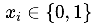
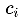
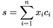
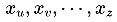
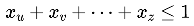
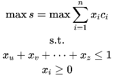

# UESTCourse
电子科大学生排课脚本代码


### 一、简介

​	UESTCer在选择了自己心仪的课程之后，往往需要根据自己的时间安排进行排课。在排课的时候，大多数课程都会有多个开班，将自己所选课程加入自己的课程表中并且不会发生冲突，同时又能保证特定时间段可以空闲出来（如：开组会），有时是件枯燥且烦恼的事情（如：想要的排课方案压根不存在）。

​	为了解决这个问题，该排课脚本应运而生。该排课脚本使用`Python`语言进行编写，能够快速且高效地生成所有可行的排课方案，同时允许设置时间占位符以及选择校区，并最终以课表形式保存为`MarkDown`文档，方便查看。排课算法使用回溯法，采用递归实现，代码整体结构清晰整洁。


### 二、使用方式

**注意**：如果你的计算机上没有`Python`，可以在[Python官网](https://www.python.org/downloads/)下载安装。

1. 将代码下载到本地：

   ```shell
   # 在命令提示符中输入
   git clone https://github.com/mo-vic/UESTCourse.git
   ```

2. 安装代码依赖：

   ```shell
   # 在命令提示符中输入
   pip3 install -r requirements.txt
   ```

3. 从个人网上选课系统的选课页面复制课程信息，粘贴到一个新建的`Excel`文件里面，`Excel`表格头格式为：

   | 课程编号 | 课程名称(班级) | 开课院系 | 任课教师 | 上课时间地点 | 校区 | 学时 | 学分 | 容纳人数 | 预选人数 |
   | :------- | :------------- | :------- | :------- | :----------- | :--- | :--- | :--- | :------- | :------- |

   **注意**：`Excel`文件中只保留自己想选的课程！！！

4. 在`UESTCourse`文件夹目录下，打开命令提示符，运行如下命令：

   ```shell
   python3 start.py --campus="清水河" --time_placeholder="星期三第5-6节" --time_placeholder="星期三第7-8节" --excel "Courses.xlsx"
   ```

   其中：

   ​	`--campus`：指的是校区，后面的参数可以是`"清水河"`或`"沙河"`，若不指定`--campus`参数，则默认为两个校区。

   ​	`--time_placeholder`：指的是时间占位符，可以设置空闲时间（如：组会时间）。设置格式示例：`星期三第5-6节`。

   ​	`--excel`：上述课程信息`Excel`文件的所在路径。

5. 查看在`UESTCourse`文件夹目录下生成的`Schedule.md`，推荐使用[Typora](https://typora.io/)或[Visual Studio Code](https://code.visualstudio.com/)打开。


### 三、最优化选课

如何在所有心仪的课程中，找到一个时间不冲突的排课方案，使得课程总学分最高呢？

设每个课程是否选择为，对应的学分为，总学分，对于时间冲突的课程，有约束，则该排课问题的数学模型为整数规划：




### 四、To Do

- [ ] 优化时间冲突检测
- [ ] 打包成可执行文件

